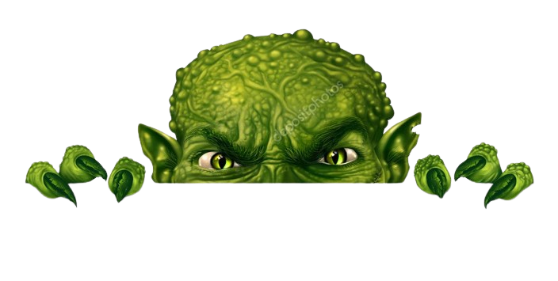
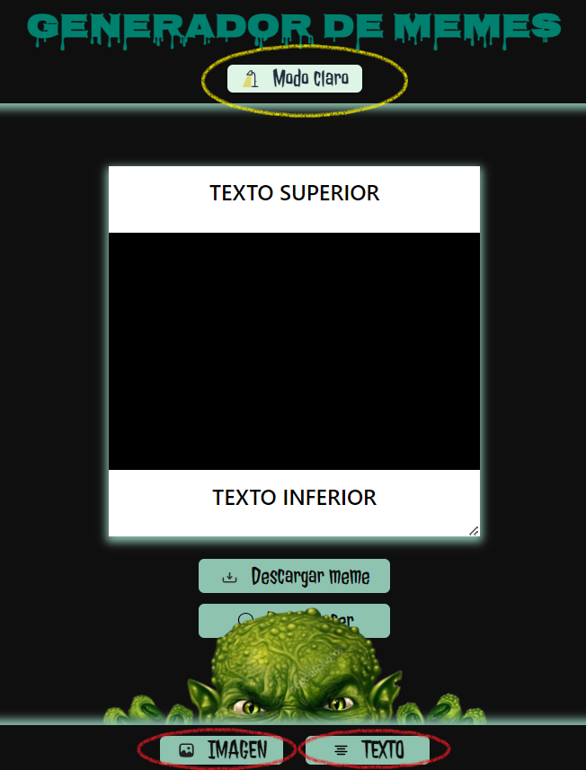
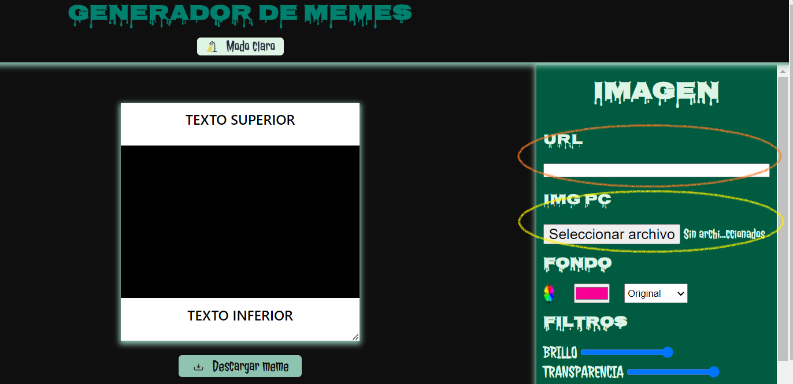
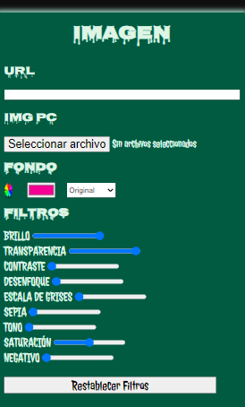
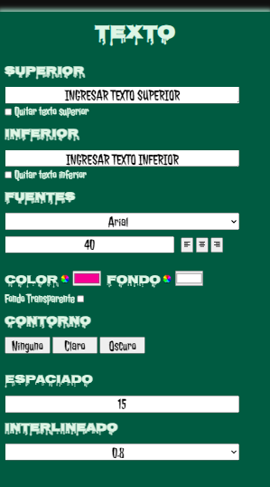
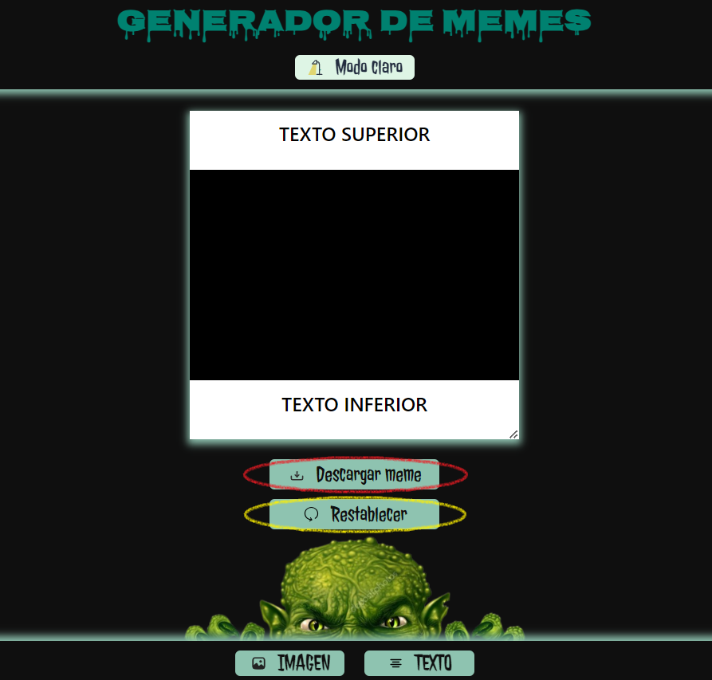
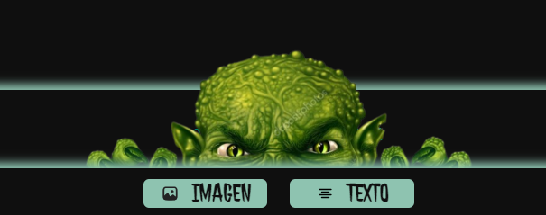

# Generador de Memes
BIENVENID@S A LA APLICACIÓN MÁS APOCALÍPTICA PARA CREAR MEMES

## El paso a paso para crear tu meme:

### Página principal
El generador de memes te da la opción para modo claro o modo oscuro (amarillo).
Abriendo los paneles de imagen y texto vas a poder subir tu imagen y aplicarle las modificaciones que necesites (rojo).

### Subí la imagen que desees
Podes hacerlo desde el panel de imagen con el URL de la imágen que encontraste en tu navegador, sin la necesidad de descargarla. Tené en cuenta que hay imágenes con derecho de autor, o con algunas reestricciones que no van a permitir que la descargues. (naranja)

O podés subir una imágen desde tu PC. Es la forma más confiable a la hora de la descarga. (amarillo)

### Modificá la imagen
Dentro del panel de Imagen vas a encontrar diferentes opciones para modificar tu imagen. Ellas son:
- Cambiar color de fondo

- Cambiar composición de fondo
- --Aclarar
- --Oscurecer
- --Diferencia
- --Luminosidad
- --Multiplicar

- Cambiar filtros:
- --Brillo
- --Opacidad
- --Contraste
- --Desenfoque
- --Escala de grises
- --Sepia
- --Tono 
- --Saturación
- --Negativo

- Restablecer filtros

### Modificá el texto
Dentro del panel de texto vas a encontrar opciones para:
- Editar texto superior
- Remover texto superior
- Editar texto inferior
- Remover texto inferior
- Cambiar familia de fuente
- Cambiar tamaño de fuente
- Cambiar alineación
- Cambiar color de texto
- Cambiar color de fondo de texto
- Fondo de texto transparente
- Cambiar padding de texto
- Cambiar alto de línea de texto

### Descarga y Recarga
Solo fata apretar el boton de descarga para que puedas tener tu meme listo y en tu pc o móvil! (rojo)

Si necesitas volver a empezar tenés a tu disposición el boton para reestablecer la página. (amarillo)

## No te olvides de molestar a Juan Zombie!!

A Juan le da mucha curiosidad ver tus memes, está muy aburrido en el mundo apocalíptico y viene a divertirse un rato con tus creaciones. Pero Juan es bastante antisocial, por eso vas a lograr que se esconda si lo molestas!! Lo bueno, es que son tan graciosos tus memes, que Juan no se resiste y vuelve. 😉

## Estado del Proyecto
El Generador de Memes está finalizado, con posibilidad de mejoras constantes.

## Licencia
Este Generador de Memes es propiedad de **Trinidad Lari** y está bajo su nombre. Todos los derechos reservados. 
[Generador de Memes][https://github.com/TrinidadLari/Generador-de-Memes]  

❤️❤️❤️❤️❤️❤️❤️❤️❤️❤️❤️❤️❤️❤️❤️❤️❤️❤️❤️❤️❤️ 

 